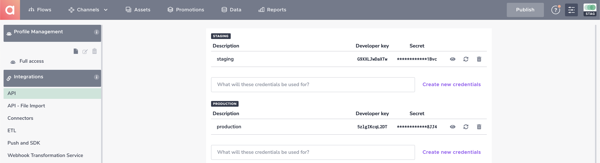

# Configuration of the Agillic Solution

## Introduction

This section will help you to configure the Agillic Solution an
obtain the keys and id's you need to be able configure and initialize
the AgillicMobileSDK into your Android application.

---

To get started, login to your Agillic Solution and select **Settings** in the top right corner.

## SDK Configuration

In order to configure the SDK in your Android application you will need to reference your Agillic solutionId, apiKey and apiSecret.

Click "Push and SDK" in the left sidebar to view your staging and production solutionIds.

Click "API" view or create an apiKey and apiSecret.

## Push Notifications

Next, select **Push and SDK** in the left pane Menu, under **Integrations** and check the "enable push" checkbox

**Enter application name.**

**Enter Client Application id.** This should correspond to the package name of your Android application.

**Enter Service account and remember to click save.** This should correspond to the service account key of a Firebase service account authorized to manage Firebase features such as the Firebase Cloud Messaging API.
Access or create a service account by navigating to [Google Cloud Platform](https://console.cloud.google.com).
From there select your Firebase project. Then click IAM & Admin in the sidebar and then Service Accounts.

Continue using an existing service account or click "CREATE SERVICE ACCOUNT" to create a new one.

When you have a valid service account, click the actions button and then "Manage keys".

Click "ADD KEY" and then "Create new key".

In the dialog, ensure that JSON is selected and click create.

This will download a json file containing the service account key.

It is important that your Firebase project has the Cloud Messaging API enabled.

